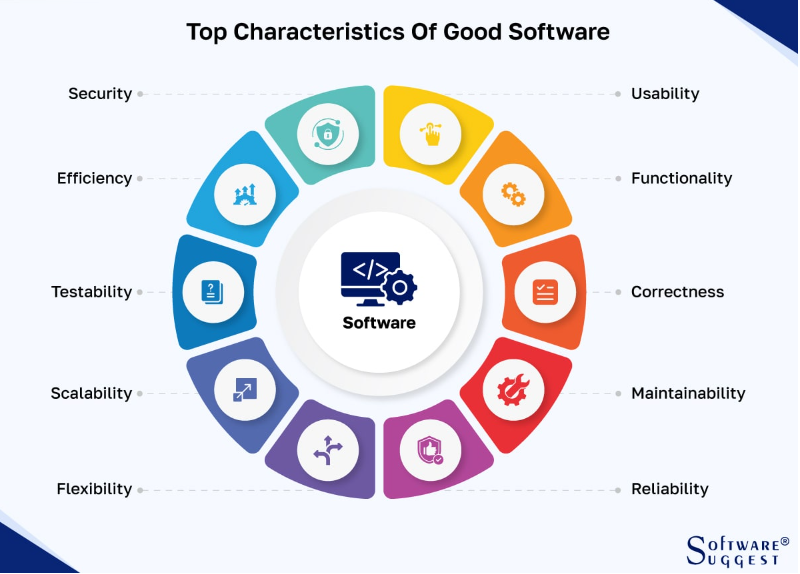
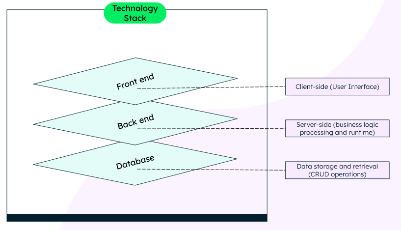
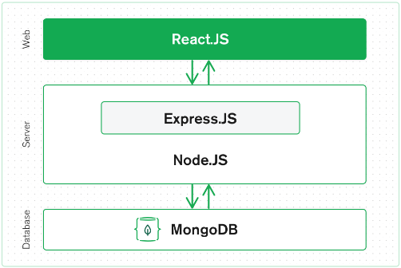

# NathanKeen_T3A1

# Q1	Provide an overview and description of a standard source control process for a large project:
For a large software project, a **standard source control process** should be structured, collaborative, and adaptable to ensure code quality, stability, and team efficiency.  Here's an overview of a typical process that leverages modern version control best practices:  

1. **Central Repository Setup:**  
    * Establish a **central code repository** on a distributed version control system like *Git*.  This serves as the "single source of truth" for all project code.  
    * Define a **main branch**(e.g. `main`, `master`, or `trunk`) to maintian the stable, production ready version of the software.  This branch reflects the latest version of the code that has passed all the testing stages and is ready for deployment.  
    * Create **developement branches** that represents various lines of active developement, such as features, releases, or bug fixes.  

2. **Branching Strategy:**  
    * Branching is key in managing concurrent workstreams across a large team.  Use a structured branching model to avoid conflicts and maintain clear workflows: 

        * **Feature Branches:**   

            - Each new feature,bug fix, or task is developed on its own branch(e.g. `feature/new-login-page`).  
            - Developers create a branch from the main or developement branch, keeping changes isolated until the feature is reeady.  
            - Combine feature branches with **feature flags** to deploy code incrementally and control the release of features in production without modifiying the main codebase.  

        * **Release Branches:**  
            - Used to prepare for a software release, starting from the main branch(e.g. `release/1.0`).  
            - All final changes and critical fixes for a release are applied here, ensuring stability and quality before deployment.  
            - After deployment, changes are merged back into the main branch and potentially into other release branches for maintenance.  

        * **Hotfix Branches:**  
            - Used to address critical production issues quickly.  These branches are created directly from the main branch(e.g. `hotfix/urgent-issue`) and merged back after fixes are tested.  

        * **Task Branches:**  
            - For agile teams, task or issue branches(e.g. `task/JIRA-123`) are tied to specific user stories or bugs tracked in a tool like Jira, providing better traceability and alignment with project management.  

3. **Pull Requests and Code Reviews:**
    * Developers submit **pull requests** to merge their branch into the main or developement branch.  
    * Code reviews are mandatory before merging, ensuring quality control and adherence to coding standards.  
    * Pull requests should be detailed descriptions of changes, relevent issue numbers, and testing results to facilitate effective reviews.  

4. **Continuous Integration(CI) and Automated Testing:**  
    * Implement a *CI pipeline* that automatically builds and tests new code when changes are pushed to any branch.  
    * Use automated tests to validate code quality, minimise integration issues, and ensure compatibility across branches.  
    * Successful CI tests signal that a branch is safe to merge, failing tests alert developers to conflicts or issues that must be resolved.  

5. **Merging and Integration:**  
    * Encourage frequent merging to keep branches up-to-date with the latest changes from the main branch and prevent large, complex merges later.  
    * Use *fast-forward* or *squash merges* for clean histories in the main branch and to make tracking changes easier.  
    * Developers regularly **pull updates** from the main branch to ensure their branch remains compatible and up-to-date.  

6. **Traceability and Documentation:**  
    - Maintain clear commit messages and link changes to issue tracking systems like Jira.  
    - Annotated histories help developers understand changes, root causes of issues, and long-term design evolution, making it easier to work effectively with legacy code or plan new features.  

7. **Release Management and Deployment:**  
    - **Release branches** undergo thorough testing and QA to ensure that code is production-ready.  
    - Implement *tagging* to mark specific releases(e.g. `v1.0`, `v1.1`), making rollbacks easier if needed.  
    - Deploy from release branches or main branches based on the project’s deployment strategy, using *continuous delivery(CD)* practices where applicable.  

8. **Post-Deployment Support:**  
    - After deployment, use hotfix branches to address urgent issues while keeping the main branch stable.  
    - Merge hotfixes into release and main branches to maintain consistency.  

## Summary 
A standard source control process for a large project is centered around structured branching, disciplined merging, rigorous testing, and collaborative workflows.  It ensures that changes are controlled, traceable, and integrated smoothly across development teams, enabling efficient scaling, faster development cycles, and reliable software delivery.  

### references 
* https://www.atlassian.com/git/tutorials/what-is-version-control  
* https://www.atlassian.com/agile/software-development/branching  
* https://www.dell.com/en-au/blog/best-practices-for-scaling-version-control-in-the-large-enterprise/

# Q2	What are the most important aspects of quality software?

Quality software is defined by how well it meets user requirements, performs its intended functions, and adapts to evolving needs.  It plays a crucial role in achieving business goals,improving user satisfaction,and ensuring long term success.  The following identifies the key aspects of quality software, based on fundamental software quality metrics and attributes.  These aspects encompass operational efficiency, transitional adaptability and ease of maintenance, offering a holistic perspective on what makes software effective and reliable.  
  

## Usability
Usability is a fundamental aspect of quality software, focusing on how easy and intuitive the software is for users.  Quality software should have a clean, user-friendly interface that requires minimal effort to navigate and understand.  When usability is prioritised, users are more likely to engage with the software, promoting user satisfaction and loyalty.  Strong usability not only drives higher adoption rates but also enhances customer retention and creates a positive user experience.  

* **Example:**
    - Consider a mobile app that features a clear, intuitive layout, allowing users to easily find and use its main features, such as browsing products, adding items to a cart, and completing a purchase within a few clicks.  This kind of user-friendly design promotes seamless interaction and satisfaction.

## Functionality  
Functionality ensures that the software performs as intended, delivering all required features and capabilities.  Quality software should be capable of executing its tasks accurately and reliably.  Functional software meets user expectations by offering a complete toolkit of features, making it effective for both individual users and businesses alike.  Functionality is integral to providing value, as it determines how well the software fulfills its core objectives.  

* **Example:**
    - An e-commerce platform that offers a well-designed checkout process illustrates good functionality. It consistently guides users through the necessary steps, allowing them to complete transactions smoothly and without errors.  

## Reliability
Reliability is the ability of software to perform consistently under specified conditions, handling faults and exceptions effectively.  Reliable software minimises system failures, data loss, and unexpected crashes, ensuring users can depend on it to complete tasks.  It promotes user trust, as it assures users that the software will work as intended, even in challenging environments.  Reliability is particularly critical for maintaining high levels of customer satisfaction and reducing downtime.  

* **Example:**
    - A cloud storage service that automatically backs up user data while handling potential errors gracefully without losing files demonstrates high reliability.  Users can trust that their files will be safe and accessible even during network interruptions.  

## Performance
Performance measures how efficiently software operates, including response times, processing speed, and resource utilisation.  High-performance software maximises system resources while maintaining optimal speed, even when handling large amounts of data or traffic.  Performance is crucial for providing a seamless user experience, as it affects how quickly users can complete tasks and interact with the software.  Efficient software also reduces operational costs, making it a vital component of business success.  

* **Example:**
    - A database management system that maintains fast query response times, even when handling large datasets, exemplifies strong performance.  Users can access and manage data quickly, improving productivity and overall satisfaction.  

## Security
Security is one of the most important aspects of quality software, given the increasing risks of cyber threats.  Quality software must protect user data and system resources from unauthorised access, ensuring confidentiality, integrity, and authenticity. It should include secure coding practices, encryption, and robust access controls to safeguard data. Strong security measures build user trust, prevent breaches, and ensure compliance with legal and regulatory requirements.  

* **Example:**
    - A banking app implementing two-factor authentication ensures secure access to accounts. This measure prevents unauthorised access, reinforcing users’ trust in the app’s ability to protect sensitive financial information.  

## Maintainability
Maintainability refers to the ease with which software can be updated, modified, and enhanced.  Quality software should have clear documentation, modular code, and a well-structured design that facilitates modifications.  It should be adaptable to evolving requirements and technological changes, minimising disruptions during updates. Maintainability reduces long-term costs, improves the efficiency of updates, and supports the software’s continued relevance.  

* **Example:**
    - A content management system with a modular codebase allows developers to add new features or make changes without disrupting existing functionality.  This setup supports ongoing improvements and helps maintain the software’s relevance in changing environments.  

## Flexibility
Flexibility measures the software’s ability to adapt to new requirements, technologies, or business processes.  Quality software is designed to accommodate changes, whether in business rules, regulations, or user needs.  It should allow for extensions, integrations, and modifications without compromising its core functionality.  Flexibility is vital for ensuring long-term usability, as it enables software to evolve with user demands and market trends.  

* **Example:**
    -  A project management tool that allows users to customise workflows, add new task types, and integrate various communication tools like Slack or Microsoft Teams without requiring significant changes to the underlying codebase.  This capability supports diverse team structures and evolving project requirements.  

## Scalability
Scalability is the capacity of software to handle increased workloads or expanded functionalities while maintaining performance.  Quality software should be designed to support both vertical scalability (adding resources to a single system) and horizontal scalability (adding more systems).  Scalable software can accommodate growth in user base, data volume, and functionality, making it a valuable asset for businesses aiming to expand or adapt quickly to changing market conditions.  

* **Example:**
    - A cloud-based customer relationship management system that can accommodate an expanding number of users and customer data without affecting response times demonstrates strong scalability.  

## Reusability
Reusability involves designing software components that can be reused in other projects or contexts.  Quality software includes common components, modules, or libraries that facilitate code reuse, reducing development time and costs.  Reusability supports faster iterations, streamlined development processes, and consistent functionality across multiple software solutions.  

* **Example:**
    - A library of standardised, well-documented APIs that can be used across multiple projects, reducing development time and ensuring consistency, is a prime example of reusability in software.  

## Testability
Testability is the ease with which software can be tested to ensure it functions correctly. Quality software is designed to allow for comprehensive testing, with clear criteria for validating its performance.  High testability reduces the risk of undetected bugs, ensures code quality, and enables quicker bug fixes.  It is critical for maintaining overall software reliability, as it helps developers identify and resolve issues before they affect users.  

* **Example:**
    - An application with automated unit tests and clear testing criteria allows developers to quickly identify and resolve issues during the development phase, enhancing the overall quality of the software.  

## Conclusion
The most important aspects of quality software encompass a blend of operational efficiency, adaptability, and ease of maintenance.  Usability, functionality, reliability, performance, security, maintainability, flexibility, scalability, reusability, and testability are crucial for delivering a robust software solution that aligns with user needs and business goals. By focusing on these aspects, software developers can ensure high-quality software that not only meets immediate requirements but also supports long-term growth, user satisfaction, and business success.

### references  
* https://www.softwaretestinghelp.com/what-are-the-quality-attributes/ 
* https://www.geeksforgeeks.org/software-engineering-characteristics-of-good-software/  
* https://www.softwaresuggest.com/blog/characteristics-of-good-software/
* https://getdx.com/blog/software-quality-metrics/  

# Q3	Outline a standard high level structure for a MERN stack application and explain the components

## Overview of MERN Stack
A standard high-level structure for a **MERN stack application** is organised into three main tiers: **frontend**, **backend**, and **database**, all interconnected to facilitate end-to-end development using JavaScript. Here’s how the architecture is generally structured:  
  
- **Frontend (React.js)**
- **Backend (Express.js & Node.js)**
- **Database (MongoDB)**

Each of these tiers interacts through HTTP requests, JSON data exchange, and server communication to provide a seamless user experience.

## Components of a MERN Stack Application

  

### 1. Frontend: React.js
- **Role**: Handles the client-side, rendering the user interface and managing user interactions.  
- **Structure**:  
  - **Components**: React is built on a component-based architecture where individual components represent distinct parts of the user interface(e.g. header, footer, forms, etc.).  
  - **State Management**: React uses hooks like `useState` and `useEffect` to manage and manipulate the state of the application.  
  - **Routing**: Client-side routing is often managed using libraries like **React Router** to handle different URLs and display corresponding components without reloading the page.  
- **Data Flow**: React sends HTTP requests(GET, POST, PUT, DELETE) to the backend to fetch, update, or delete data, using JavaScript libraries like Axios or Fetch API.  
- **Output**: The front end renders data dynamically and updates the view based on user actions.  

### 2. Backend: Express.js & Node.js
- **Role**: Manages the server-side logic, routes requests, and handles communication between the client and the database.  
- **Express.js**:  
  - A **minimalist web framework** for Node.js that helps manage HTTP requests and responses.  
  - **Routing**: Sets up routes to handle API requests(e.g. `/api/users`, `/api/posts`) and middleware for authentication, logging, or error handling.  
  - **Middleware**: Includes request parsers, authentication checks, and response headers to manage server functionality.  
- **Node.js**:  
  - Serves as the **runtime environment** for executing JavaScript code on the server.  
  - Handles **server hosting** and integrates Express.js for routing, middleware, and API endpoints.  
  - Uses **non-blocking I/O** and event-driven architecture, making it efficient for handling concurrent requests.  
- **API Communication**: The backend exposes RESTful APIs or GraphQL endpoints for the frontend to communicate with.  The data is typically sent and received in **JSON format**.  

### 3. Database: MongoDB  
- **Role**: Serves as the database layer, storing data and facilitating CRUD operations.  
- **Data Storage**:  
  - MongoDB is a **NoSQL document-oriented database** that stores data in **JSON-like documents**(BSON format).  
  - It offers a **flexible schema**, making it easy to adapt to changing data structures.  
- **Data Interaction**:  
  - **Mongoose**, an ODM (Object Data Modeling) library for MongoDB and Node.js, is often used to define schemas, models, and manage interactions with the database.  
  - It supports CRUD operations like `find()`, `insertOne()`, `updateOne()`, and `deleteOne()`, which correspond to HTTP methods in the backend.  
- **Scalability**: MongoDB’s distributed nature makes it scalable for handling large volumes of data and high-traffic applications.  

## How Components Interact in a MERN Stack Application
- **Frontend to Backend**:  
  - The frontend(React) sends requests to the backend(Express/Node) to fetch or update data.  For instance, when a user submits a form, React sends a POST request to an Express.js endpoint.  
- **Backend to Database**:  
  - The backend processes requests, performs data validation, and communicates with the MongoDB database using Mongoose or MongoDB Node.js driver.  
- **Backend to Frontend**:  
  - After performing the necessary operations on the data, the backend sends responses(often in JSON format) back to the frontend.  
- **Frontend Rendering**:  
  - React renders the data dynamically based on the response received, updating the UI accordingly.  

## Key Features of the MERN Stack Structure
- **Unified Language**: JavaScript is used throughout the stack, simplifying the development and reducing transition times between layers.  
- **JSON Data Flow**: JSON is used for data exchange across all tiers, from front-end requests to database storage.  
- **Component-Based Development**: Modular structure allows for easy maintenance, scaling, and debugging, as each tier handles a specific part of the application.  

This high-level structure makes the **MERN stack** an efficient choice for building scalable, dynamic web applications.  

### references
* https://medium.com/@shivang1691401/understanding-clean-architecture-in-mern-building-robust-and-maintainable-applications-7546805fd849  
* https://www.mongodb.com/resources/languages/mern-stack 
* https://emeritus.org/blog/what-is-mern-stack/ 

# Q4	A team is about to engage in a project, developing a website for a small business. What knowledge and skills would they need in order to develop the project?
## Essential Knowledge and Skills Required for a Small Business Website Development Project.  

When developing a website for a small business, a skilled web development team must possess a variety of competencies to deliver a high-quality, user-friendly, and functional product. The following outlines the core areas of expertise necessary for the project, focusing on team roles, technical requirements, and specialised knowledge.  

## Project Management
### Skills Needed:  
* Effective communication with team members and stakeholders.  
* Proficiency in project management and reporting tools.  
* Strong organizational abilities.  
* Knowledge of project management methodologies.  

**Role Summary:**  The Project Manager(PM) is responsible for coordinating the team, setting project timelines, and aligning deliverables with client expectations.  The PM ensures that the project remains on schedule and meets quality standards while facilitating smooth collaboration across all team members.  

## Technical Architecture
### Skills Needed:  

* Full-stack web development knowledge.  
* IT infrastructure design.  
* Communication and product design abilities.  

**Role Summary:** The Solution Architect(or Project Architect) oversees the technical aspects of the project.  This role involves selecting the appropriate tech stack, which may include APIs, frameworks, databases, and third-party integrations, as well as designing an architectural diagram to guide the development process.  They also identify potential risks and challenges, ensuring the project aligns with the client's technical requirements.  

## Business Analysis
### Skills Needed:  

* Strong client communication and problem-solving skills.  
* Business analytics and administrative skills.  
* Understanding of data visualisation  

**Role Summary:** The Business Analyst(BA) gathers and interprets client requirements, converting them into actionable specifications.  They analyze factors such as the client's target audience, competitive landscape, and budget to create a project proposal that guides the development team.  The BA helps bridge the gap between client expectations and technical execution.  

## Web Development
### Core Roles and Skills:

* **Front-End Developer:**  

    - Proficiency in HTML, CSS, and JavaScript.  
    - Ability to create user-facing components that are both functional and visually appealing.  
    - Familiarity with SEO best practices to optimise site performance.  

* **Back-End Developer:**  

    - Expertise in server-side programming.  
    - Knowledge of data management, security, and website performance optimisation.  
    - Ability to build and maintain databases and server infrastructure.  

* **Full-Stack Developer:**  

    - Comprehensive understanding of both front-end and back-end development.
    - Proficiency across multiple frameworks and tools for managing the complete development process.  

**Role Summary:** Web developers are responsible for constructing the site's technical framework.  This includes creating both user-facing features(front-end) and back-end infrastructure that powers the site's functionality.  Full-stack developers, if present, provide oversight and support for both areas.  

## UI/UX Design
### Skills Needed:  

* Proficiency in design and prototyping tools.  
* Understanding of wireframing and mockup creation.  
* Analytical skills for user research.  
**Role Summary:** UI/UX Designers ensure the website is visually appealing and user-friendly.  By researching the client's niche, competition, and audience, they develop layouts, colors, and interactions that align with user needs and preferences.  Designers produce wireframes and prototypes to guide the development of a cohesive user interface.  

## Quality Assurance(QA)
### Skills Needed:

* Proficiency with testing and debugging tools.  
* Attention to detail and critical thinking.  
* Understanding of website functionality from a user perspective.  
**Role Summary:** The QA Manager tests each aspect of the website to ensure it meets functionality, usability, and quality standards.  By developing test cases and using automated tools, they identify and report issues for the development team to address, ensuring the website performs optimally in various conditions.  

## Content Management
### Skills Needed:  

* Strong written and verbal communication.  
* Content creation and editing expertise.  
* Working knowledge of SEO principles.  

**Role Summary:** The Content Manager is responsible for creating and overseeing website content, ensuring it aligns with the brand's message and engages the target audience. They develop content strategies, manage writers, and analyze user engagement to adjust content as needed.  

## Marketing Strategy
### Skills Needed:

* In-depth market research abilities.  
* Competency in analyzing trends and making strategic recommendations.  
* Understanding of web design principles for customer engagement.  

**Role Summary:** Marketing Strategists help the business stand out by identifying market opportunities, tracking industry trends, and developing actionable plans to enhance the brand's online presence.  They support the team in creating a website that resonates with the business's audience and meets strategic goals.  

## SEO Expertise
### Skills Needed:

* Competency in SEO techniques such as keyword research, traffic analysis, and local optimisation.  
* Understanding of programming and web analytics tools.  

**Role Summary:** The SEO Specialist optimises the website to increase search engine visibility, ensuring it appears in relevant searches.  They work closely with the development and content teams to enhance mobile friendliness, security, and responsiveness, increasing the site's search engine ranking and accessibility.  

## Conclusion

A web development project requires a balanced team with technical, creative, and strategic skills.  By ensuring each of these roles is filled with competent professionals, the team can create a website that is functional, attractive, and optimised for both user experience and business growth. Each team member's unique expertise contributes to a cohesive process, enabling the successful launch of an effective website for the client.  

### references
* https://www.forbes.com/advisor/business/website-development/
* https://www.markup.io/blog/web-development-team-structure/#:~:text=In%20short%2C%20you%20need%20a%20skilled%20web%20development,Project%20managers%20SEO%20specialists%20UI%2FUX%20designers%20Content%20specialists

# Q5	With reference to one of your own projects, discuss what knowledge or skills were required to complete your project, and to overcome challenges

## Blogger Platform API Webserver 

Completing this project required a blend of technical knowledge, problem-solving skills, and project management abilities.  Here's a breakdown of the essential skills and knowledge areas needed to bring this project to fruition and address the challenges faced along the way:  

## Backend Development and Frameworks:  

* **Flask:** Proficiency with Flask as a web framework was essential, as it provided the foundation for handling HTTP requests, routing, and managing responses. Knowledge of Flask's ecosystem, including extensions like Flask-JWT-Extended for authentication and Flask-SQLAlchemy for database integration, allowed for efficient development.  
* **Routing and Middleware:** Understanding HTTP methods and creating RESTful routes were crucial.  Middleware skills also helped in adding layers of security and managing pre/post-request processes.  

## Database Design and Management:  

* **SQL and Database Design:** Proficiency in SQL and database design principles, especially with PostgreSQL, enabled the structuring of data to ensure both efficiency and scalability.  Knowledge of normalisation and relational data models was key in structuring tables to avoid redundancy and maintain data integrity.  
* **ORM (Object Relational Mapping):** SQLAlchemy, paired with Flask-SQLAlchemy, required familiarity with ORM concepts for mapping Python objects to database tables.  This skill was necessary for managing relationships between entities, such as the one-to-many relationship between users and blogs, and the many-to-many relationship between users and roles.  

## Authentication and Authorisation:  

* **JWT Authentication:** Understanding JSON Web Tokens(JWT) and how they work allowed for secure, token-based user authentication.  Implementing role-based access control(RBAC) required knowledge of securing routes and managing user permissions dynamically based on their roles.  
* **Password Hashing and Security:** Skills in securely storing user credentials were essential.  Using libraries like Flask-Bcrypt for password hashing ensured passwords were stored safely, adding another layer of security to prevent breaches.  

## Data Serialization and Validation:  

* **Data Serialization:** Knowledge of Marshmallow for serializing and deserializing objects was essential for converting complex data types to JSON format, making it easier to work with APIs.  This skill helps bridge backend data models with the frontend requirements.  
* **Input Validation:** Validating incoming data was crucial for maintaining data integrity. Marshmallow schemas were used to ensure that the data entering the system was clean, complete, and in the expected format.  

## Error Handling and Debugging:  

* **Error Handling:** Building a robust error-handling framework required knowledge of handling HTTP status codes and managing server-side errors gracefully. Implementing proper feedback in case of authorisation issues, database errors, or invalid input helped in debugging and enhancing user experience.  
* **Debugging and Testing:** Debugging skills helped in troubleshooting issues throughout development.  Testing the application thoroughly, especially around authentication, role assignments, and data validation, ensured smooth functionality and security compliance.  

## Project Management:  

* **Task Allocation with Trello:** Familiarity with project management tools like Trello helped in organising tasks, setting deadlines, and tracking progress visually.  This skill was valuable for maintaining a structured workflow and ensuring timely project milestones.  
* **Version Control with Git/GitHub:** Proficiency with Git and GitHub was crucial for managing code changes, creating pull requests, and handling code reviews.  Version control also helped in tracking project history, which is beneficial for maintaining a clean and collaborative codebase.  

## Documentation and API Design:  

* **API Documentation:** The ability to document API endpoints was essential, especially for a multi-user application where other developers might interact with the code. Writing clear and concise documentation for each endpoint helped both in testing and in potential handovers.  
* **REST API Design:** Knowledge of REST principles ensured that the API was intuitive and consistent, making it easy to navigate and implement.  Understanding resource-oriented URLs and using appropriate HTTP methods like GET, POST, PUT, and DELETE allowed the API to align with industry standards.  

## Challenges and Solutions:  

* **Authentication Complexity:** Implementing role-based access control while managing different user permissions was challenging.  To address this, I spent time refining user roles, permissions, and securing each route according to role requirements.  

* **Database Relations:** Handling many-to-many relationships between users and roles required careful planning.  Understanding how to use a join table to maintain this relationship in a normalised structure helped maintain database integrity.  

* **API Security and Error Handling:** Ensuring secure API access and providing informative yet secure error responses required careful consideration.  Detailed error logging and refining JWT-based route protections helped tackle security vulnerabilities.  

## Conclusion:  

The completion of this project required a strong command of backend technologies, database management, API design, and security protocols. Each challenge reinforced my skills in structuring complex systems, handling authentication securely, and creating a robust content management API that could serve a wide variety of users and roles in a secure and scalable manner.

# Q6	With reference to one of your own projects, evaluate how effective your knowledge and skills were for this project, and suggest changes or improvements for future projects of a similar nature

## Blogger Platform API Webserver 

In this project, my knowledge and skills were largely effective in achieving the goals, as I was able to design, develop, and submit a fully functional and secure API that meets the needs of a multi-user blogging platform. However, reflecting on the process has highlighted areas where further learning or refinement could enhance future projects.  

## Evaluation of Skills and Effectiveness:  

1. **Backend Development with Flask:**  

    - My experience with Flask provided a solid foundation for building the backend API, handling routing, and integrating various extensions.  Flask's simplicity allowed me to quickly set up and manage endpoints.  
    - **Effectiveness:** *High*.  The project was completed efficiently, and the use of Flask allowed for smooth routing and quick development.  
    - **Improvement:** Consider exploring Flask's asynchronous capabilities or using a more extensive framework like Django for larger projects where built-in functionalities like admin panels could save development time.  

2. **Database Design and Management(PostgreSQL and SQLAlchemy):**  

    - I was able to implement a normalised relational database schema that maintains data integrity and scales well.  My skills with SQLAlchemy allowed for straightforward CRUD operations and managing complex relationships between entities.  
    - **Effectiveness:** *High*. Database integrity was maintained throughout, with proper relationships and efficient queries.  
    **Improvement:** Learning more about database indexing and optimisation for high-traffic applications would be valuable.  Additionally, considering NoSQL databases, like MongoDB, could be beneficial for projects that prioritise flexibility over strict relational models.  

3. **Authentication and Authorisation(JWT and RBAC):**  

    - Implementing JWT authentication and role-based access control (RBAC) was successful, securing sensitive data and protecting routes based on user roles.  I was able to implement secure password hashing and validate JWTs effectively.  
    - **Effectiveness:** *Moderate to High*. JWT and RBAC worked well, but implementing finer-grained permission controls proved challenging.  
    - **Improvement:** Consider exploring OpenID Connect or OAuth2 for more complex authentication needs, as they offer more robust, standard-compliant approaches for token-based security.  For highly sensitive applications, two-factor authentication (2FA) could add an additional security layer.  

4. **API Design and Documentation:**  

    - My knowledge of RESTful API principles enabled me to design a clear, consistent API structure, and I documented each endpoint's requirements, making it easier for potential collaborators or users.  
    - **Effectiveness:** *High*. The API is well-structured, and endpoints are consistent, making interactions predictable and reliable.  
    - **Improvement:** Learning about API versioning would enhance future projects, particularly for maintaining backward compatibility.  Experimenting with tools like Swagger or Postman could also improve documentation by generating user-friendly, interactive documentation automatically.  

5. **Error Handling and Debugging:**  

    - Error handling was adequate for catching and logging issues, and descriptive error messages helped streamline debugging.  
    - **Effectiveness:** *Moderate*. Basic error handling was functional, but the system could be more robust for managing unexpected edge cases.  
    - **Improvement:** Incorporating a centralised logging system, like Sentry, for real-time monitoring of application errors would be beneficial, especially for production environments. Additionally, unit testing for edge cases could catch errors that standard debugging might miss.  

6. **Data Validation and Serialisation(Marshmallow):**

    - Marshmallow allowed for consistent validation and serialisation of data, reducing errors in API requests and responses.  
    - **Effectiveness:** *High*. Marshmallow efficiently managed data formatting and validation.  
    - **Improvement:** Adding stricter validation rules or custom validators could improve the reliability of data handling.  Experimenting with alternative libraries like Pydantic (which offers enhanced validation features) could also streamline validation in future projects.  

7. **Project Management with Trello and GitHub:**  

    - Trello kept tasks organised, and GitHub allowed for effective version control, making it easy to revert or track changes.  
    - **Effectiveness:** *Moderate*. Basic task management and version control were maintained, but more advanced tracking could be implemented.  
    - **Improvement:** For future projects, integrating continuous integration/continuous deployment (CI/CD) via GitHub Actions or a similar tool could improve productivity by automating testing and deployment.  Additionally, exploring Agile project management practices or tools like Jira might enhance team collaboration for larger projects.  

## Suggested Improvements for Future Projects:  

1. **Enhancing Security Practices:**  

    - While the project followed standard security practices(e.g., JWTs, bcrypt), there is room to enhance security.  Implementing features like two-factor authentication(2FA) could offer additional security layers, particularly for user authentication and data access.  

2. **Advanced Database Optimisation:**

    - Understanding advanced database optimisation techniques, like indexing frequently accessed fields or using caching solutions like Redis, could enhance performance, particularly for read-heavy applications. These optimisations would be beneficial as the application scales and usage increases.  

3. **Asynchronous Programming and Scalability:**

    * Implementing asynchronous handling for non-blocking operations(e.g., adding async capabilities in Flask) would improve scalability and response times, especially for high-traffic scenarios.  

4. **Enhanced API Documentation and Developer Experience:**

    - Using Swagger or OpenAPI specifications to auto-generate documentation would offer a better developer experience by providing interactive documentation for testing endpoints.  This would make it easier for developers to understand and integrate with the API.  

5. **User Feedback and User-Centric Design:**

    - Incorporating user feedback early in the design phase could ensure the API meets user needs more effectively. For example, getting feedback on the categorisation system and user roles could lead to better role definitions or feature enhancements.   

## Conclusion:

The combination of technical skills and project management strategies led to a successful completion of this project, with a robust, secure API meeting the requirements of a multi-user blogging platform.  Going forward, improvements like advanced security measures, and database optimisation would enhance future projects, particularly as they scale.  Additionally, experimenting with newer libraries and frameworks could improve development efficiency and ensure that applications are resilient, secure, and adaptable to users' evolving needs.  

### references
* https://www.geeksforgeeks.org/synchronous-and-asynchronous-programming/
* https://www.ibm.com/topics/redis 
* https://swagger.io/blog/api-strategy/difference-between-swagger-and-openapi/ 

# Q7	Explain control flow, using an example from the JavaScript programming language

# Q8	Explain type coercion, using examples from the JavaScript programming language

# Q9	Explain data types, using examples from the JavaScript programming language

# Q10	Explain how arrays can be manipulated in JavaScript, using examples from the JavaScript programming language

# Q11	Explain how objects can be manipulated in JavaScript, using examples from the JavaScript programming language

# Q12	Explain how JSON can be manipulated in JavaScript, using examples from the JavaScript programming language